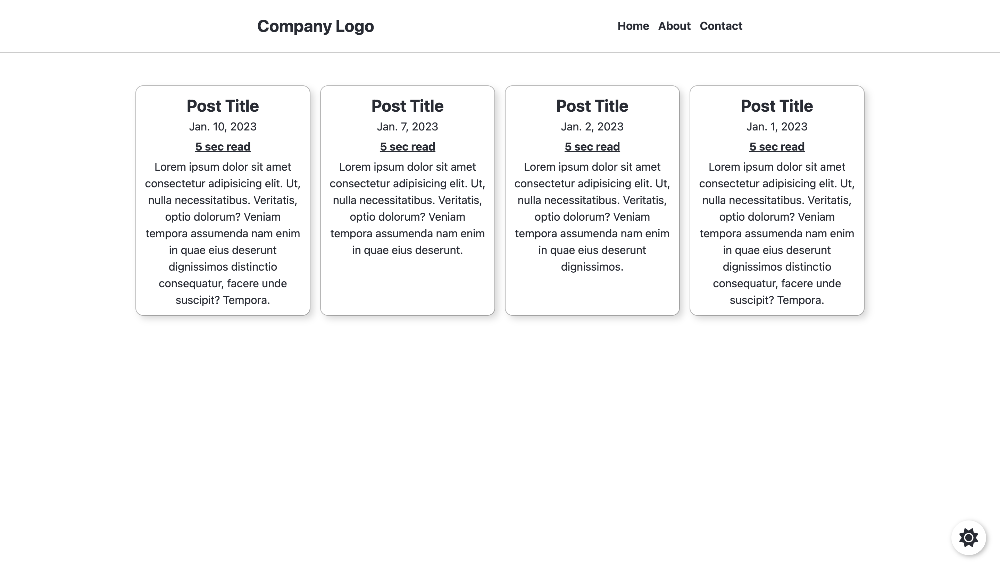
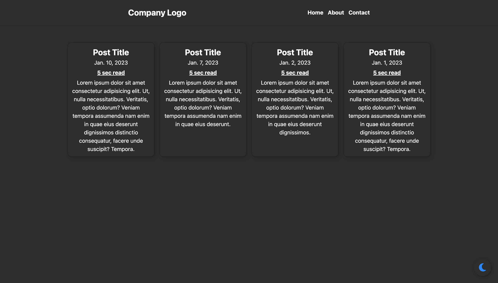

<!-- PROJECT LOGO -->
 

  <h2 align="center">Dark Mode Feature</h3>
  
  
  

    View Project Demo
     
    <a href="https://darkmode-feature-demo.williamhmoody.com">View Demo</a>
  

<!-- TABLE OF CONTENTS -->

  
Table of Contents

  <ol>
    <li>
      <a href="#about-the-project">About The Project</a>
      <ul>
        <li><a href="#built-with">Built With</a></li>
      </ul>
    </li>
    <li><a href="#usage">Usage</a></li>
    <li><a href="#contact">Contact</a></li>
    <li><a href="#license">License</a></li>
  </ol>

<!-- ABOUT THE PROJECT -->
## About The Project
This simple application incorporates a dark mode feature into any webpage using JavaScript and local storage to save the website current state.

(<a href="#readme-top" style="color: red;">back to top</a>)

### Built With

* HTML
* CSS
* JavaScript
* LocalStorage

(<a href="#readme-top">back to top</a>)

<!-- USAGE EXAMPLES -->
## Usage of Application

Any user is able to active the dark mode feaure into their application. 
For use in your project --> must credit the creator.

  
  
   
   
   
  
   

(<a href="#readme-top">back to top</a>)

<!-- CONTACT -->
## Contact

Project Link: [Dark Mode Feature Demo](https://darkmode-feature-demo.williamhmoody.com)

(<a href="#readme-top">back to top</a>)

<!-- LICENSE -->
## License

Distributed under the MIT License.

(<a href="#readme-top">back to top</a>)

